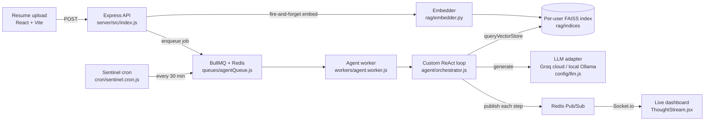

# PlacementPilot

**An autonomous, privacy-first agentic career coach that continuously monitors student placement readiness and fires real-time risk alerts to the placement cell — for universities tracking thousands of students with a handful of officers.**

[**▶ Live Demo**](https://hackathonmain.vercel.app/)) &nbsp;·&nbsp; [](https://github.com/YOUR-USER/YOUR-REPO)

<!-- TODO: replace the demo URL + GitHub badge link above with the real ones -->


---

## Architecture

Resume upload kicks off an asynchronous pipeline: text is chunked and embedded into a per-user FAISS index, then a custom ReAct agent retrieves that context, reasons over it with an LLM, and streams every thought to the dashboard live over WebSockets. A separate cron-driven Sentinel agent runs this loop on a schedule with no user in the loop at all.



> Image diagram: drop an Excalidraw/PNG export at `client/src/assets/architecture.png` and swap the Mermaid block for it if you prefer a visual.

---

## The Agent System

A custom **ReAct loop** ([`server/src/agent/orchestrator.js`](server/src/agent/orchestrator.js)) drives every agent — `Thought → Action → Action Input → Observation`, repeated up to `maxIterations`, with hand-written parsing that intercepts malformed JSON, unwraps tool envelopes, and forces a final answer on timeout. No LangChain. Each job gets a fresh tool registry ([`tools/registry.js`](server/src/agent/tools/registry.js)) wired up per agent type in [`workers/agent.worker.js`](server/src/workers/agent.worker.js).

**Recon** — parses a resume, extracts skills, and scores the student against company requirements to produce a gap report.
Tools: `queryVectorStore` → `parseResume` → `extractSkills` → `matchCompanyReqs` ([`tools/rag.tools.js`](server/src/agent/tools/rag.tools.js), [`resume.tools.js`](server/src/agent/tools/resume.tools.js), [`company.tools.js`](server/src/agent/tools/company.tools.js)).
Why: it grounds analysis in the student's *actual* resume chunks (RAG-first) instead of LLM guesswork, then auto-chains a Strategy job ([`agent.worker.js:156`](server/src/workers/agent.worker.js)).

**Strategy** — turns a gap report into a personalized 4-week prep plan with daily tasks.
Tools: `createPrepPlan` → `savePrepPlan` ([`tools/plan.tools.js`](server/src/agent/tools/plan.tools.js)); the prompt forbids finishing before the plan is persisted ([`prompts/strategy.prompt.js`](server/src/agent/prompts/strategy.prompt.js)).
Why: a gap report nobody acts on is useless — this converts the diagnosis into a concrete schedule.

**Sentinel** — the autonomous one. A cron scans for students with `riskScore > 60` every 30 minutes and dispatches a Sentinel agent per student.
Tools: `queryStudentData` → `calculateRiskScore` → `dispatchTPCAlert` ([`tools/db.tools.js`](server/src/agent/tools/db.tools.js), [`alert.tools.js`](server/src/agent/tools/alert.tools.js)); scheduled by [`cron/sentinel.cron.js`](server/src/cron/sentinel.cron.js).
Why: officers can't refresh dashboards all day — Sentinel raises Socket.io alerts to the TPC dashboard with zero user action.

**Arena** — a strict technical interviewer for mock interviews, scoring answers against the student's weak areas.
Tools: `generateQuestion` → `evaluateAnswer` ([`tools/interview.tools.js`](server/src/agent/tools/interview.tools.js)), with `readMemory`/`writeMemory` for session context ([`tools/memory.tools.js`](server/src/agent/tools/memory.tools.js)).
Why: closes the loop — practice the exact gaps Recon found.

---

## The RAG Layer

Each `(user_id, doc_type)` pair gets its own **FAISS** `IndexFlatIP` index ([`rag/embedder.py`](rag/embedder.py)). Resume text is split into **200-word chunks with 40-word overlap** ([`rag/chunker.py`](rag/chunker.py)) so skill phrases that straddle boundaries stay intact, embedded with **`all-MiniLM-L6-v2`** (384-dim sentence-transformer), L2-normalized so inner-product equals cosine similarity, and queried at **top-k = 3** ([`rag/retriever.py`](rag/retriever.py)). FAISS over Pinecone because the whole point is privacy-first and air-gappable — indices are flat files on local disk, there's no external vector DB to ship PII to, and per-user flat indices are trivially fast at student-corpus scale. The Node side talks to a small FastAPI service ([`rag/main.py`](rag/main.py)) via [`services/rag.service.js`](server/src/services/rag.service.js), and every call degrades gracefully to `[]` when the service is cold.

---

## Evaluation

RAGAS metrics are computed over real recon agent traces (only traces with a `queryVectorStore` step) and logged to the MongoDB `ragevals` collection — see [`rag/eval_ragas.py`](rag/eval_ragas.py). The current script measures **faithfulness** and **context_precision**:

| Metric | Score | What it measures |
|---|---|---|
| `faithfulness` | `0.__` | Does the answer stay grounded in retrieved context? |
| `context_precision` | `0.__` | Is the retrieved context actually relevant to the query? |
| `context_recall` | `n/a` | Not yet computed — needs labeled ground-truth answers |

<!-- TODO: run `python -m rag.eval_ragas` after generating recon traces and paste the real numbers. To add context_recall, supply real ground_truth values in eval_ragas.py (currently it reuses the answer as ground_truth). -->

```bash
# Generate scores (requires GROQ_API_KEY or OPENAI_API_KEY for the judge LLM)
python -m rag.eval_ragas
```

---

## Tech Stack

| Layer | Tech | Why |
|---|---|---|
| Frontend | React, Vite, Tailwind, TanStack Query, Socket.io-client | Fast SPA with live thought-stream over WebSockets |
| Backend | Node.js (ESM), Express, Mongoose/MongoDB | Non-blocking API; document model fits resumes/plans |
| Queue | BullMQ + Redis | Heavy AI jobs run off the request path — no dropped requests under load |
| Agent engine | Custom ReAct orchestrator | Full control over parsing, fallbacks, and streaming — no LangChain overhead |
| LLM | Groq (`llama-3.1-8b-instant`) in prod, local Ollama (`qwen2.5:3b`) in dev | Auto-routes on `GROQ_API_KEY` ([`config/llm.js`](server/src/config/llm.js)); local mode keeps PII on-device |
| RAG | FastAPI, FAISS, sentence-transformers (`all-MiniLM-L6-v2`) | Per-user flat indices on local disk; no external vector DB |
| Real-time | Redis Pub/Sub + Socket.io | Streams agent reasoning and Sentinel alerts without polling |
| Eval | RAGAS | Real metrics on real traces, surfaced on the TPC dashboard |

---

## Project Structure

```
.
├── client/                       React + Vite frontend
│   └── src/
│       ├── components/agent/      ThoughtStream — live ReAct step feed
│       ├── hooks/useAgentStream.js  Subscribes to the agent's Socket.io stream
│       ├── lib/{api,socket}.js    REST client + Socket.io connection
│       └── pages/                 Student / TPC dashboards, AgentTraces, MockInterview
├── server/                       Node.js + Express API and worker
│   └── src/
│       ├── agent/
│       │   ├── orchestrator.js    The custom ReAct loop (core)
│       │   ├── parser.js          LLM output parsing helpers
│       │   ├── prompts/           Per-agent system prompts (recon/strategy/sentinel/arena)
│       │   └── tools/             Tool registry + tool implementations
│       ├── config/                DB, Redis, Socket.io, LLM adapter (Groq/Ollama)
│       ├── controllers/           HTTP handlers (auth, student, tpc, agent, interview)
│       ├── cron/sentinel.cron.js  Autonomous 30-min risk scan
│       ├── queues/                BullMQ job queue + Bull Board
│       ├── workers/agent.worker.js  Dedicated process that runs agent jobs
│       ├── services/rag.service.js  HTTP client for the Python RAG service
│       └── models/                Mongoose schemas (User, Resume, PrepPlan, ...)
└── rag/                          Python FastAPI RAG microservice
    ├── main.py                    /embed and /query endpoints
    ├── chunker.py                 200-word / 40-overlap chunking
    ├── embedder.py                FAISS index build + persistence
    ├── retriever.py               Top-k cosine retrieval
    └── eval_ragas.py              RAGAS evaluation over recon traces
```

---

## Local Setup

Requires Redis, MongoDB, Python 3.10+, and either a `GROQ_API_KEY` or Ollama with `qwen2.5:3b` pulled. Copy [`server/.env.example`](server/.env.example) to `server/.env` first.

```bash
# Terminal 1 — Python RAG service
cd rag && pip install -r requirements.txt
uvicorn rag.main:app --host 0.0.0.0 --port 8001 --reload   # run from the repo root

# Terminal 2 — API + WebSocket server
cd server && npm install && npm run dev

# Terminal 3 — AI background worker
cd server && npm run worker

# Terminal 4 — Frontend
cd client && npm install && npm run dev
```

App runs at `http://localhost:5173`. Seed demo data with `cd server && npm run seed`.
